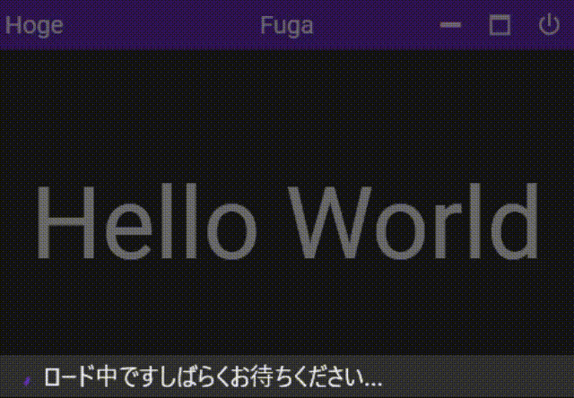

  


[Nuget](https://www.nuget.org/packages/MaterialWindowLib.Wpf)

## 概要

本ライブラリはWPFにおいてマテリアルデザインを取り入れたタイトルバーを含む
ウィンドウを提供するライブラリである。

---

## MaterialDesignInXamlToolkitのスタイルを適用せずに使用する

本ライブラリに依存するMaterialDesignInXamlToolkitのスタイルを適用せずに
下記コードのようにMaterialWindow要素を使用すると下記写真のような
ウィンドウを作成できる。

### MainWinodw.xaml

```xaml
<mw:MaterialWindow ~省略~
                   xmlns:mw="http://StdEnku/MaterialWindowLib/Wpf">

    <mw:MaterialWindow.TitlebarLeftContent>
        <Label Content="Hoge" FontSize="20" />
    </mw:MaterialWindow.TitlebarLeftContent>
    
    <mw:MaterialWindow.TitlebarCenterContent>
        <Label Content="Fuga" FontSize="20" />
    </mw:MaterialWindow.TitlebarCenterContent>

    <Viewbox>
        <Label Content="Hello World" />
    </Viewbox>
</mw:MaterialWindow>
```

### MainWinodw.xalm.cs

```c#
namespace WpfApp;

using MaterialWindowLib.Wpf.Controls;

public partial class MainWindow : MaterialWindow
{
    public MainWindow()
    {
        InitializeComponent();
    }
}
```

### 結果


---

## MaterialDesignInXamlToolkitのスタイルを適用して使用する

[Super Quick Start · MaterialDesignInXAML](https://github.com/MaterialDesignInXAML/MaterialDesignInXamlToolkit/wiki/Super-Quick-Start)に書かれている方法に沿って
MaterialDesignInXamlToolkitのスタイルを適用した状態で本ウィンドウを表示すると
下記のように表示される。

### App.xaml

```xaml
<Application ~省略~
             xmlns:materialDesign="http://materialdesigninxaml.net/winfx/xaml/themes">

    <Application.Resources>
        <ResourceDictionary>
            <ResourceDictionary.MergedDictionaries>
                <materialDesign:BundledTheme BaseTheme="Dark" PrimaryColor="DeepPurple" SecondaryColor="Lime" />
                <ResourceDictionary Source="pack://application:,,,/MaterialDesignThemes.Wpf;component/Themes/MaterialDesignTheme.Defaults.xaml" />
            </ResourceDictionary.MergedDictionaries>
        </ResourceDictionary>
    </Application.Resources>
</Application>
```

### MainWindow.xaml

```xaml
<mw:MaterialWindow ~省略~
                   xmlns:mw="http://StdEnku/MaterialWindowLib/Wpf"
                   xmlns:materialDesign="http://materialdesigninxaml.net/winfx/xaml/themes"
                   TextElement.Foreground="{DynamicResource MaterialDesignBody}"
                   TextElement.FontWeight="Regular"
                   TextElement.FontSize="13"
                   TextOptions.TextFormattingMode="Ideal" 
                   TextOptions.TextRenderingMode="Auto"        
                   Background="{DynamicResource MaterialDesignPaper}"
                   FontFamily="{DynamicResource MaterialDesignFont}"
                   TitlebarBackground="{DynamicResource PrimaryHueMidBrush}">

    <mw:MaterialWindow.TitlebarLeftContent>
        <Label Content="Hoge" FontSize="20" />
    </mw:MaterialWindow.TitlebarLeftContent>
    
    <mw:MaterialWindow.TitlebarCenterContent>
        <Label Content="Fuga" FontSize="20" />
    </mw:MaterialWindow.TitlebarCenterContent>

    <Viewbox>
        <Label Content="Hello World" />
    </Viewbox>
</mw:MaterialWindow>
```

### MainWinodw.xalm.cs

```c#
namespace WpfApp;

using MaterialWindowLib.Wpf.Controls;

public partial class MainWindow : MaterialWindow
{
    public MainWindow()
    {
        InitializeComponent();
    }
}
```

### 結果


---

## MaterialWindowクラスの概要

### プロパティ

| プロパティ名           | 型        | 備考                                                         | 規定値                                     |
| ---------------------- | --------- | ------------------------------------------------------------ | ------------------------------------------ |
| TitlebarHeight         | double    | タイトルバーの高さを指定するための依存関係プロパティ         | 40                                         |
| ButtonIconSize         | double    | ボタン内のアイコンサイズを指定するための依存関係プロパティ   | 25                                         |
| TitlebarLeftContent    | object    | タイトルバー左端のコンテンツ指定用依存関係プロパティ         | null                                       |
| TitlebarCenterContent  | object    | タイトルバー中央のコンテンツ指定用依存関係プロパティ         | null                                       |
| TitlebarBackground     | Brush     | タイトルバーの背景用ブラシ依存関係プロパティ                 | Brushes.LightGray                          |
| ResizeBorderThickness  | Thickness | リサイズ用領域の範囲指定用依存関係プロパティ                 | Thickness(10, 0, 10, 10)                   |
| IsBottomDrawerShow     | bool      | 画面下部のDrawerを表示するかどうか指定するための依存関係プロパティ | false                                      |
| BottomDrawerText       | string    | 画面下部のDrawerに表示する文字列を指定するための依存関係プロパティ | string.Empty                               |
| BottomDrawerTextSize   | double    | 画面下部のDrawerに表示する文字列のサイズ指定するための依存関係プロパティ | 20                                         |
| LoadedCommand          | ICommand  | Loaded時に実行されるコマンド                                 | null                                       |
| LoadedCommandParameter | object    | Loaded時に実行されるコマンド用パラメータ                     | null                                       |
| ExitButtonCommand      | ICommand  | 終了ボタン押下時に実行されるコマンド                         | 実行時にアプリケーションを終了するコマンド |

## 画面下部のDrawerの概要



MaterialWindowクラスは上記画像のように画面下部にDrawerを保持しており、
BottomDrawerTextプロパティにテキストの内容を指定して
BottomDrawerTextSizeプロパティでテキストサイズを指定し、
IsBottomDrawerShowプロパティで表示のON/OFFを切り替える事が可能である。

Drawerが表示された状態ではタイトルバーのボタンの操作はロックされるので
アプリの終了を拒否したいセーブ時などに使用すると有効である。

## 注意点

ExitButtonCommand依存関係プロパティに自作のコマンドをバインドした場合
そのコマンド内でアプリケーションを終了する処理を書かなければ
アプリケーションを終了することはできないので
別途アプリケーション終了用ViewServiceを組んでそのコマンド内から呼び出してください。

## Dependency Library

[MaterialDesignInXamlToolkit](https://github.com/MaterialDesignInXAML/MaterialDesignInXamlToolkit)

```text
The MIT License (MIT)

Copyright (c) James Willock,  Mulholland Software and Contributors

Permission is hereby granted, free of charge, to any person obtaining a copy
of this software and associated documentation files (the "Software"), to deal
in the Software without restriction, including without limitation the rights
to use, copy, modify, merge, publish, distribute, sublicense, and/or sell
copies of the Software, and to permit persons to whom the Software is
furnished to do so, subject to the following conditions:

The above copyright notice and this permission notice shall be included in all
copies or substantial portions of the Software.

THE SOFTWARE IS PROVIDED "AS IS", WITHOUT WARRANTY OF ANY KIND, EXPRESS OR
IMPLIED, INCLUDING BUT NOT LIMITED TO THE WARRANTIES OF MERCHANTABILITY,
FITNESS FOR A PARTICULAR PURPOSE AND NONINFRINGEMENT. IN NO EVENT SHALL THE
AUTHORS OR COPYRIGHT HOLDERS BE LIABLE FOR ANY CLAIM, DAMAGES OR OTHER
LIABILITY, WHETHER IN AN ACTION OF CONTRACT, TORT OR OTHERWISE, ARISING FROM,
OUT OF OR IN CONNECTION WITH THE SOFTWARE OR THE USE OR OTHER DEALINGS IN THE
SOFTWARE.
```

[XamlBehaviorsWpf](https://github.com/microsoft/XamlBehaviorsWpf)

```text
The MIT License (MIT)

Copyright (c) 2015 Microsoft

Permission is hereby granted, free of charge, to any person obtaining a copy
of this software and associated documentation files (the "Software"), to deal
in the Software without restriction, including without limitation the rights
to use, copy, modify, merge, publish, distribute, sublicense, and/or sell
copies of the Software, and to permit persons to whom the Software is
furnished to do so, subject to the following conditions:

The above copyright notice and this permission notice shall be included in all
copies or substantial portions of the Software.

THE SOFTWARE IS PROVIDED "AS IS", WITHOUT WARRANTY OF ANY KIND, EXPRESS OR
IMPLIED, INCLUDING BUT NOT LIMITED TO THE WARRANTIES OF MERCHANTABILITY,
FITNESS FOR A PARTICULAR PURPOSE AND NONINFRINGEMENT. IN NO EVENT SHALL THE
AUTHORS OR COPYRIGHT HOLDERS BE LIABLE FOR ANY CLAIM, DAMAGES OR OTHER
LIABILITY, WHETHER IN AN ACTION OF CONTRACT, TORT OR OTHERWISE, ARISING FROM,
OUT OF OR IN CONNECTION WITH THE SOFTWARE OR THE USE OR OTHER DEALINGS IN THE
SOFTWARE.
```


